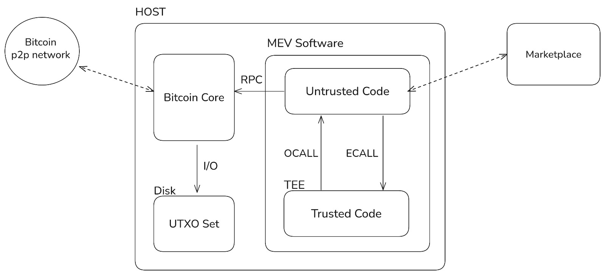
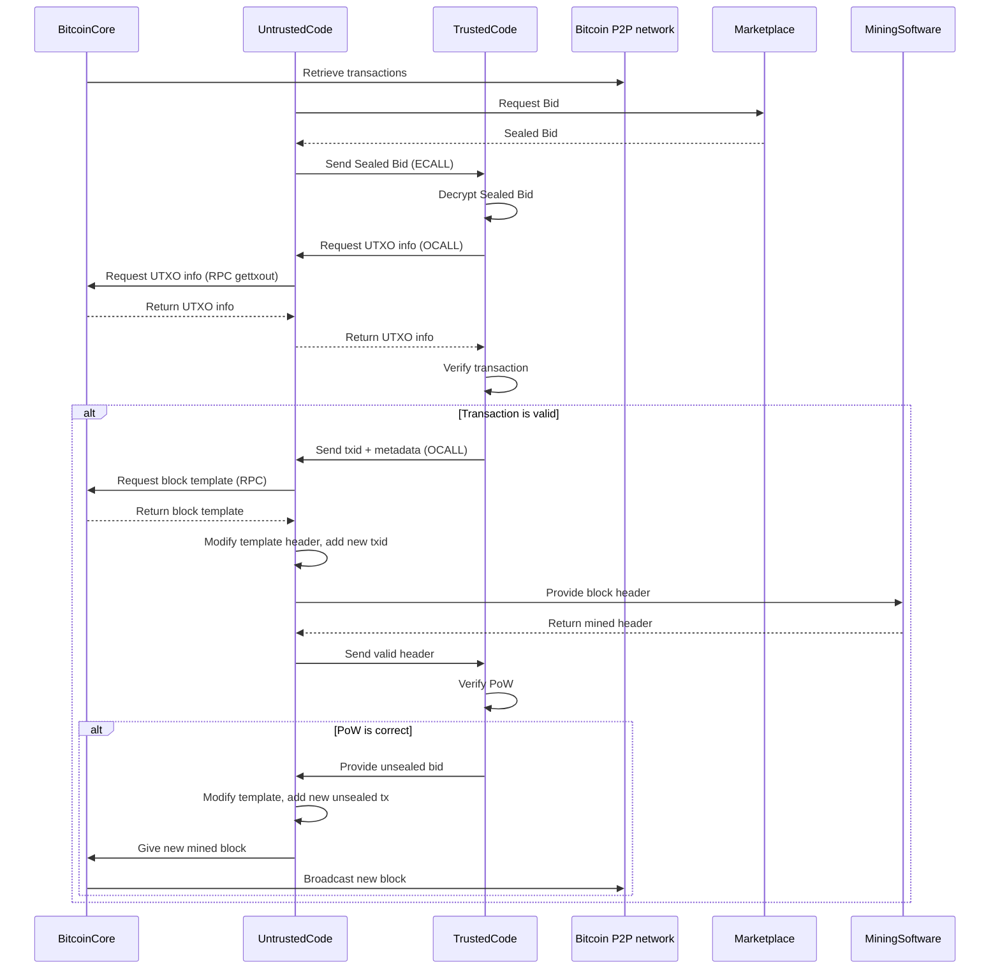

# MEV extracter miner software workflow

This document walks through the architecture and flow diagrams that illustrates how the **market place**, the **MEV software**, the **mining software** and the **Bitcoin Core** node interact between each other to create, validate, and broadcast a new block that includes sealed transactions.

---

## Architecture and Participants

As can be seen in the architecture diagram there are six entities that interact between each other:

| Symbol | Description |
|--------|-------------|
| **BitcoinCore** | A full Bitcoin node controled by the miner retrieveing transactions and broadcasting new blocks. |
| **UntrustedCode** | Code running outside the trusted enclave in charge of interacting with the Marketplace and the Bitcoin Node. |
| **TrustedCode** | Enclave‑protected code that verifies the sealed transaction and makes it public when the PoW is satisfied. |
| **Bitcoin P2P network** | The normal Bitcoin peer‑to‑peer network. |
| **Marketplace** | An external marketplace service where bids are placed. |
| **MiningSoftware** | The miner software that handles all process to solve the PoW of the new block. |

---

## Step‑by‑Step Walkthrough

1. **Fetching Transactions**  
   `BitcoinCore → Bitcoin P2P network : Retrieve transactions`  
   The node constantly retrieves new transactions from its peers.

2. **Bid Request**  
   `UntrustedCode → Marketplace : Request Bid`  
   The MEV Software asks the marketplace for a sealed bid.

3. **Sealed Bid Delivery**  
   `Marketplace → UntrustedCode : Sealed Bid`  
   The marketplace returns the encrypted (sealed) bid.

4. **Enclave Interaction – ECALL**  
   `UntrustedCode → TrustedCode : Send Sealed Bid (ECALL)`  
   The sealed bid is passed into the trusted enclave via an *ECALL*.

5. **Decrypting the Bid**  
   `TrustedCode → TrustedCode : Decrypt Sealed Bid`  
   Inside the enclave, the bid is decrypted.

6. **Requesting UTXO Information – OCALL**  
   `TrustedCode → UntrustedCode : Request UTXO info (OCALL)`  
   The enclave asks the outer code for the necessary UTXO data.

7. **Fetching UTXO Data**  
   `UntrustedCode → BitcoinCore : Request UTXO info (RPC gettxout)`  
   The untrusted code queries Bitcoin Core for the specific UTXO via RPC `gettxout`.

8. **Returning UTXO Info**  
   `BitcoinCore → UntrustedCode : Return UTXO info`  
   Bitcoin Core replies with the requested output data.

9. **Passing UTXO Back to Enclave**  
   `UntrustedCode → TrustedCode : Return UTXO info`  
   The data is handed back to the trusted enclave.

10. **Transaction Verification**  
    `TrustedCode → TrustedCode : Verify transaction`  
    The enclave validates the transaction.

11. **If the Transaction Is Valid…**  

    - **Send TxID & Metadata**  
      `TrustedCode → UntrustedCode : Send txid + metadata (OCALL)`  
      Metadata contains information about requirements from the bidder such as position in block.

    - **Obtain Block Template**  
      `UntrustedCode → BitcoinCore : Request block template (RPC)`  
      `BitcoinCore → UntrustedCode : Return block template`  
      The Bitcoin Node provides with a fresch new block template built only with information from his local mempool.

    - **Modify Header**  
      `UntrustedCode → UntrustedCode : Modify template header, add new txid`  
      It also checks if adding this new transaction creates some conflict with other transactions. That is possible as the UTXO being spent was made public in step 6.

    - **Hand Header to Miner**  
      `UntrustedCode → MiningSoftware : Provide block header`  
      `MiningSoftware → UntrustedCode : Return mined header`  

    - **Validate Proof‑of‑Work**  
      `UntrustedCode → TrustedCode : Send valid header`  
      `TrustedCode → TrustedCode : Verify PoW`  
      In order to verify the PoW some checkpoints of the blockchain have to be hardcoded inside the TEE code.
      The motivation of this is that a malicious miner could lie the TEE making him think he found a block by providing a low PoW header.

12. **If PoW Is Correct…**  

    - **Provide Unsealed Bid**  
      `TrustedCode → UntrustedCode : Provide unsealed bid`  
      The TEE reveals the sealed tx.

    - **Add Unsealed Transaction**  
      `UntrustedCode → UntrustedCode : Modify template, add new unsealed tx`  
      The untrusted code modifies the template to add the sealed tx.

    - **Submit Mined Block**  
      `UntrustedCode → BitcoinCore : Give new mined block`

    - **Broadcast Block**  
      `BitcoinCore → Bitcoin P2P network : Broadcast new block`

---

## Summary

- **Untrusted code** orchestrates the flow, handling RPC calls and interacting with external services.  
- **Trusted code** (running inside a secure enclave) performs all cryptographic checks—decrypting bids, verifying transactions, and confirming PoW—without exposing sensitive data.
- The **Bitcoin Core** node supplies blockchain state (UTXOs, block templates) and ultimately broadcasts the newly mined block to the **Bitcoin P2P network**.

This separation ensures that private bid information and verification logic stay protected.

---